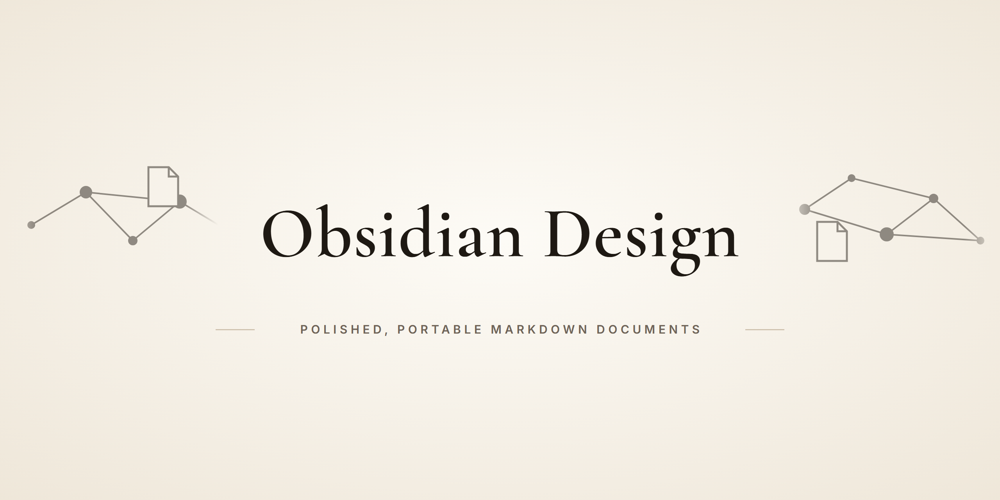

<p align="center">
  
</p>

<p align="center"><a href="README.md">한국어</a> · <b>English</b></p>

# Obsidian Design

> **A Codex skill that makes the agent write or improve Obsidian and Markdown documents that help the reader understand, decide or act.**

For project notes, guides, reports, design proposals, meeting records and technical docs. Clear structure and accurate content
come before decoration, and existing frontmatter, links, block IDs and user-written content are preserved.

> **Status: a document-writing rule set with no version number.** `SKILL.md` plus two reference files, documented for Codex.
> No tests or example outputs. Claude Code can load the same format, but the author has not verified it there yet.

## Why

`SKILL.md` opens with its goal: a finished document that helps its intended reader understand, decide or act. It guards against three things.

- **Decoration first**: no ornamental badges, empty sections, `N/A` rows or forced checklists. A short note does not need a report template.
- **Notes broken by an edit**: frontmatter, wikilinks, block IDs, attachments and user content are preserved, and the diff is reviewed.
- **Plausible filler**: it never invents citations, measurements, owners, deadlines, test results, personal paths, secrets or
  sources. Unknown owners and dates in meeting notes are left out or marked.

## What it does

| Step | What the agent does |
|---|---|
| Document contract | Infers purpose, audience, destination and type; reads only the target note and relevant conventions or neighbors; asks only for blocking information. |
| Compose for the reader | Descriptive title, headings ordered by reader questions, evidence for claims, facts kept apart from interpretation, tables only for real comparisons. A screenshot is not proof of a passing test. |
| Markdown/Obsidian hygiene | Portable links, frontmatter first with quoted wikilinks, blank lines around blocks, escaped table pipes; no raw HTML, plugin-only features or badges unless required. |
| Finish and verify | Rereads as the audience; checks claims, links and placeholders; runs an existing Markdown checker if there is one; says when rendering was not checked; reviews the diff. |

## How it works

The agent reads `SKILL.md` in full and opens a reference only when needed: [`document-patterns.md`](references/document-patterns.md)
for structure and syntax, [`manual-rules.md`](references/manual-rules.md) only for CAD/STL/URDF or other project-specific
evidence. `agents/openai.yaml` holds Codex UI metadata only.

| Type | Useful progression (`document-patterns.md`) |
|---|---|
| Project overview | Purpose → current state → scope → key decisions → resources → next steps |
| How-to | Expected result → prerequisites → numbered steps → verification → troubleshooting |
| Design proposal | Problem → constraints → alternatives and tradeoffs → chosen design → validation → open decisions |
| Research/report | Question → evidence and method → findings → limitations → implications |
| Meeting record | Context/date → decisions → essential discussion → actions and unresolved questions |
| Technical reference | Purpose → inputs/outputs → contracts and examples → edge cases → sources |

**Optional CAD/STL/URDF rules** are project conventions, not Markdown defaults: binary STL size checks, `1 µm` URDF validation,
a `16 MB` HTML artifact budget, and never silently deleting a wrong measurement. They route to an external manual
(`<vault-root>/path/to/CAD-visualization-documentation-manual.md`) that is not shipped here; if it is unavailable, the agent
says so instead of claiming it was checked.

## Install

```bash
# Codex: clone into a folder named obsidian-design, then copy it
git clone https://github.com/lsy041015/Obsidian-Design.git obsidian-design
cp -R obsidian-design "${CODEX_HOME:-$HOME/.codex}/skills/"

# Validate with Codex's skill validator (part of skill-creator, not included here)
python /path/to/skill-creator/scripts/quick_validate.py obsidian-design
```

Invoke explicitly with `$obsidian-design`.

**Claude Code (same format, so it can load; not verified by the author yet)**: clone into `~/.claude/skills/obsidian-design`
and call `/obsidian-design`.

```bash
git clone https://github.com/lsy041015/Obsidian-Design.git ~/.claude/skills/obsidian-design
```

## Usage

Add `$obsidian-design` and say what to write; the Codex UI default prompt is "Use $obsidian-design to draft a clear,
source-backed Markdown document." Implicit invocation is allowed, so Codex may also pick the skill on its own. Mention the
audience, destination and template if you have them, and point to the note when editing. You get the file link and any
material limitation back, not the whole document. Check the result in Obsidian or your target renderer when it matters.

## Design notes

- Work scales to the document; nothing forces checklists, empty sections or `N/A` rows into every note.
- CAD numbers such as `0.05 mm` or `16 MB` stay in their own file, so they never become defaults for general writing.
- Updates keep existing citations and record corrections instead of erasing them.
- The skill stays portable: no user names, absolute paths, vault IDs or credentials, and the manual path is a placeholder.
- Documentation work does not authorize source edits, Git cleanup, publishing or changes to source CAD/URDF.

## Limits

No version, changelog, tests, CI or worked example. The CAD manual and the validator are not in this repository. Claude Code
use is unverified. Not for application UI design or incidental code comments.

## Credits

MIT license ([LICENSE](LICENSE), "Copyright (c) 2026 lsy"). Product names only identify the target tools and imply no
affiliation. numpy, Three.js and matplotlib are tools the CAD rules mention; none is bundled here.

---

<p align="center"><sub>LSY.KOR · <a href="https://github.com/lsy041015">More projects</a></sub></p>
